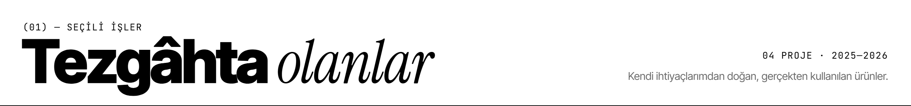
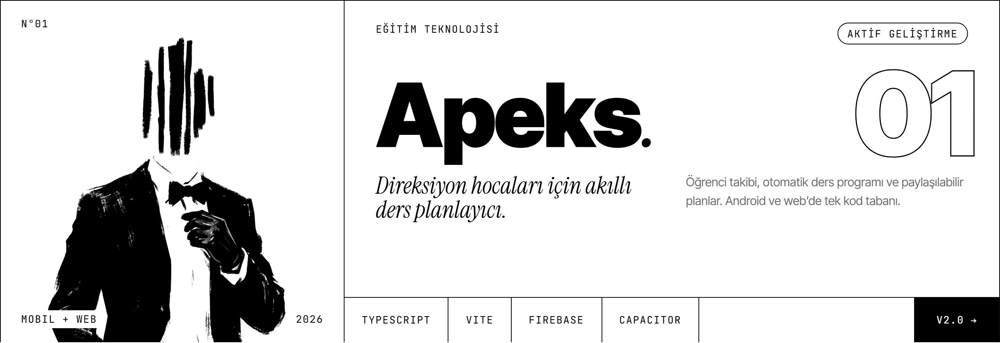
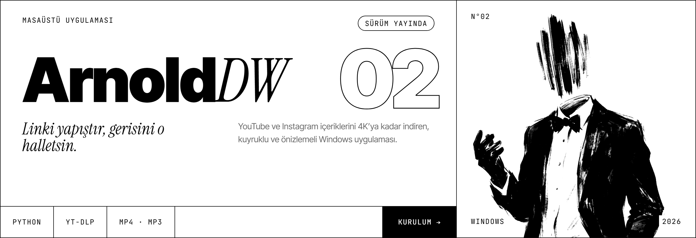
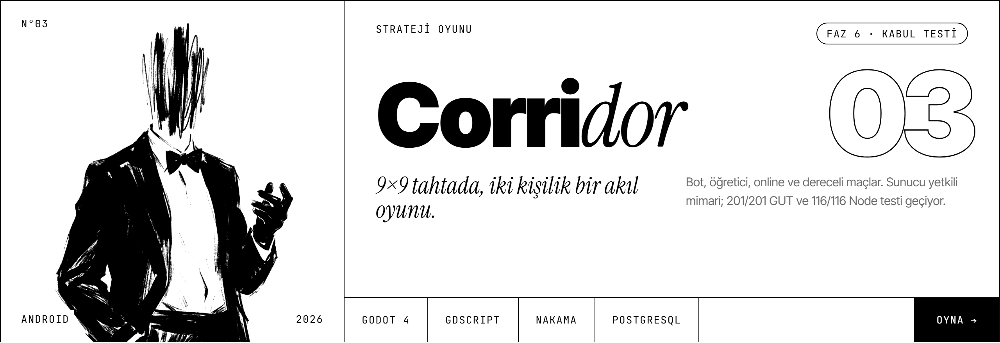
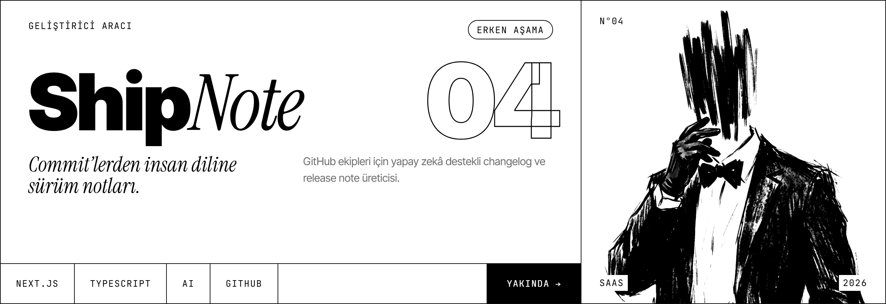
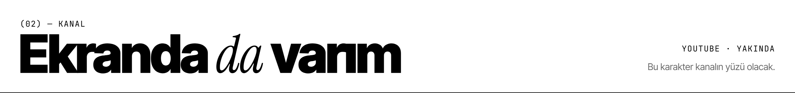
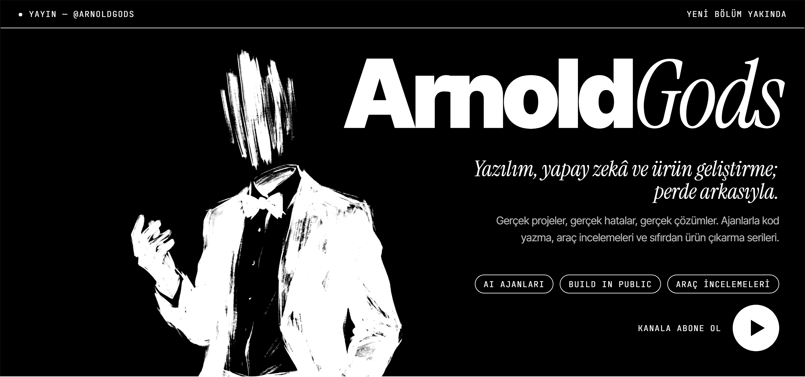
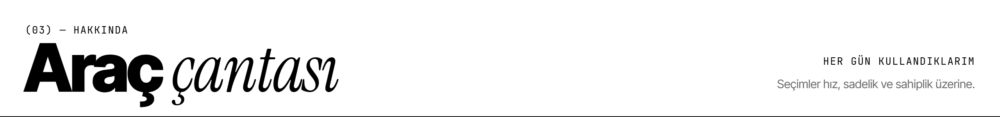
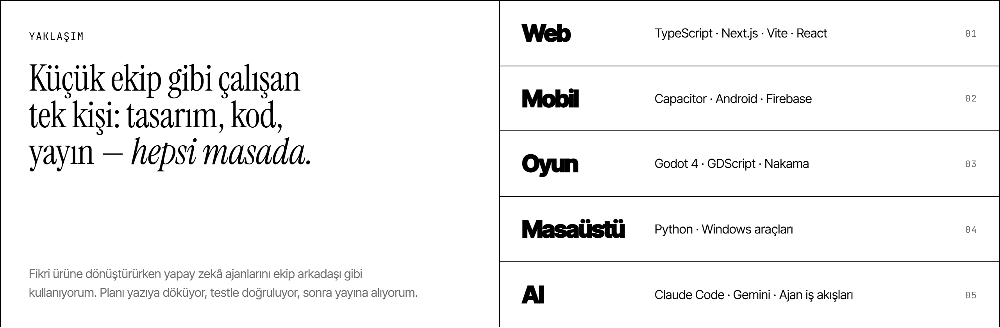
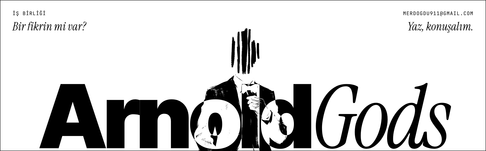

<picture>
  <source media="(prefers-color-scheme: dark)" srcset="assets/hero-dark.png">
  
</picture>

  <a href="https://www.youtube.com/@ArnoldGods"><b>YouTube</b></a> &nbsp;·&nbsp;
  <a href="https://x.com/ArnoldGods"><b>X</b></a> &nbsp;·&nbsp;
  <a href="mailto:merdogdu911@gmail.com"><b>E-posta</b></a>

 

<picture>
  <source media="(prefers-color-scheme: dark)" srcset="assets/head-work-dark.png">
  
</picture>

<picture>
  <source media="(prefers-color-scheme: dark)" srcset="assets/card-apeks-dark.png">
  
</picture>
<picture>
  <source media="(prefers-color-scheme: dark)" srcset="assets/card-arnolddw-dark.png">
  
</picture>
<picture>
  <source media="(prefers-color-scheme: dark)" srcset="assets/card-corridor-dark.png">
  
</picture>
<picture>
  <source media="(prefers-color-scheme: dark)" srcset="assets/card-shipnote-dark.png">
  
</picture>

  

<picture>
  <source media="(prefers-color-scheme: dark)" srcset="assets/head-youtube-dark.png">
  
</picture>

<a href="https://www.youtube.com/@ArnoldGods">
<picture>
  <source media="(prefers-color-scheme: dark)" srcset="assets/youtube-dark.png">
  
</picture>
</a>

  

<picture>
  <source media="(prefers-color-scheme: dark)" srcset="assets/head-about-dark.png">
  
</picture>

<picture>
  <source media="(prefers-color-scheme: dark)" srcset="assets/about-dark.png">
  
</picture>

  <picture>
    <source media="(prefers-color-scheme: dark)" srcset="https://github-readme-stats.vercel.app/api?username=arnoldgodsx&show_icons=true&count_private=true&include_all_commits=true&hide_rank=false&bg_color=000000&title_color=ffffff&icon_color=ffffff&text_color=ffffff&ring_color=ffffff&border_color=ffffff&border_radius=0">
    
  </picture>
  <picture>
    <source media="(prefers-color-scheme: dark)" srcset="https://streak-stats.demolab.com/?user=arnoldgodsx&background=000000&border=FFFFFF&stroke=FFFFFF&ring=FFFFFF&fire=FFFFFF&currStreakNum=FFFFFF&sideNums=FFFFFF&currStreakLabel=FFFFFF&sideLabels=FFFFFF&dates=FFFFFF&border_radius=0&locale=tr">
    
  </picture>

 

<picture>
  <source media="(prefers-color-scheme: dark)" srcset="assets/footer-dark.png">
  
</picture>

Karakter: Gemini Nano Banana Pro · Tasarım ve kod: <code>tools/</code>

