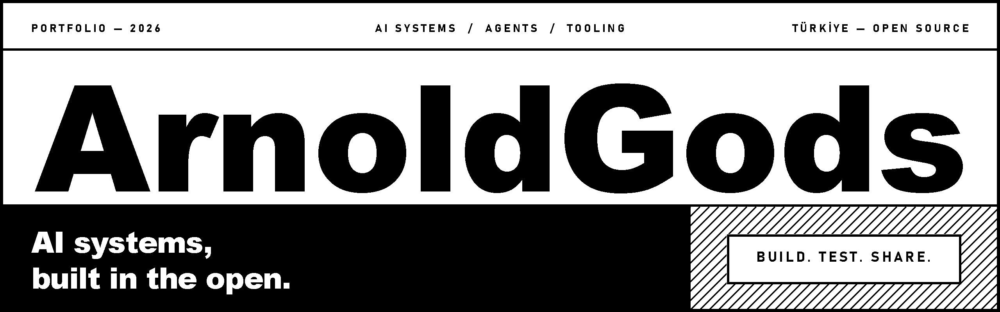
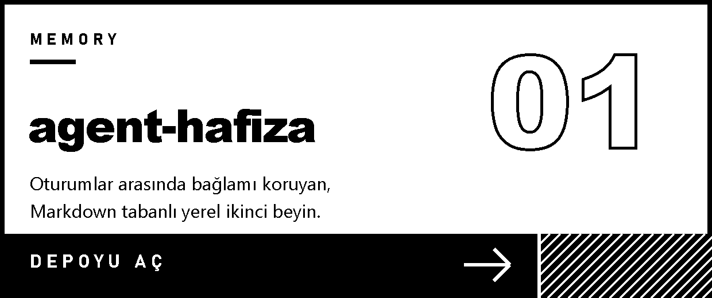
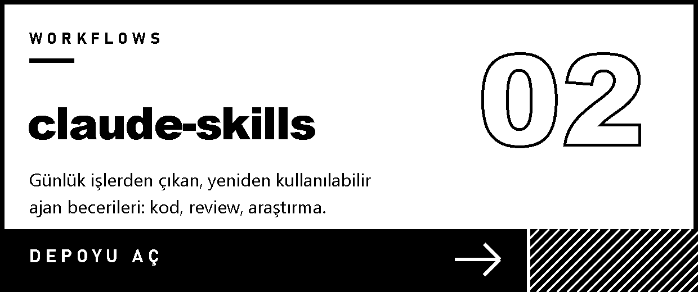
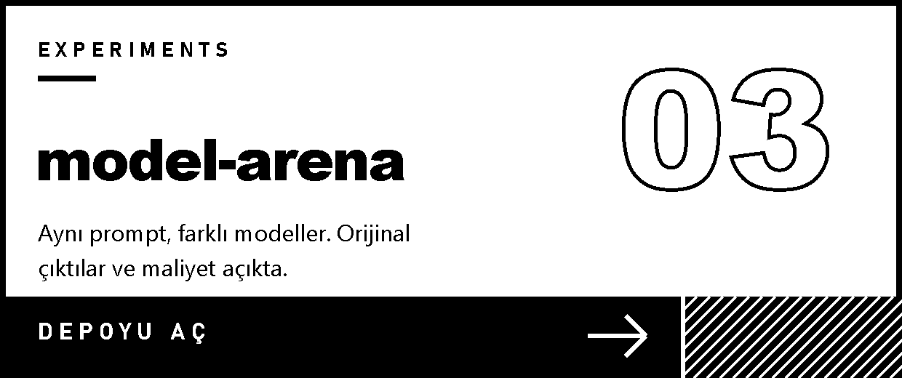
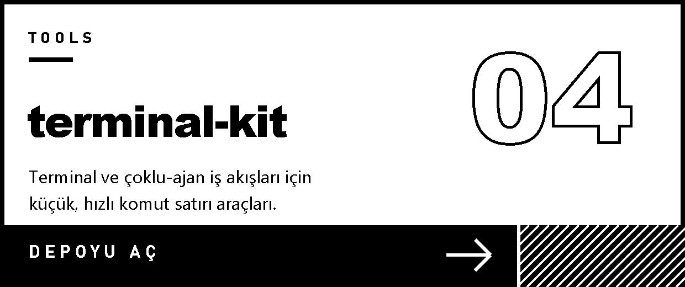

<picture>
  <source media="(prefers-color-scheme: dark)" srcset="assets/banner-dark.png">
  
</picture>

  <a href="https://github.com/arnoldgodsx"><b>GitHub</b></a> &nbsp; / &nbsp;
  <a href="https://www.youtube.com/@ArnoldGods"><b>YouTube</b></a> &nbsp; / &nbsp;
  <a href="https://x.com/ArnoldGods"><b>X</b></a> &nbsp; / &nbsp;
  <a href="mailto:merdogdu911@gmail.com"><b>İletişim</b></a>

Ben **ArnoldGods**. Ajan sistemleri kuruyor, yapay zekâ modellerini gerçek işlerde test ediyor ve kullandığım araçları açık paylaşıyorum.
Burada kodları inceleyebilir, becerileri yeniden kullanabilir ve deneyleri kendin doğrulayabilirsin.

## Projeler

  <a href="https://github.com/arnoldgodsx/agent-hafiza"><picture><source media="(prefers-color-scheme: dark)" srcset="assets/card-agent-hafiza-dark.png"></picture></a>
  <a href="https://github.com/arnoldgodsx/claude-skills"><picture><source media="(prefers-color-scheme: dark)" srcset="assets/card-claude-skills-dark.png"></picture></a>
  <a href="https://github.com/arnoldgodsx/model-arena"><picture><source media="(prefers-color-scheme: dark)" srcset="assets/card-model-arena-dark.png"></picture></a>
  <a href="https://github.com/arnoldgodsx/terminal-kit"><picture><source media="(prefers-color-scheme: dark)" srcset="assets/card-terminal-kit-dark.png"></picture></a>

## Tezgâhta

**Ajanlar için ortak bir kontrol katmanı.**
Hafızayı, bağlamı, araçları ve çalışma kayıtlarını tek yerde birleştirmeye çalışıyorum; amaç, işin oturumlar ve araçlar arasında kesintisiz sürmesi.

**Aktif geliştirme aşamasında.** Kod şu an özel.

## Açılacak birkaç deney

| Deney | Nereye bakmalı |
| :--- | :--- |
| [model-arena](https://github.com/arnoldgodsx/model-arena) | Aynı görevi çözen farklı nesil modeller, yan yana. |
| [prompt-lab](https://github.com/arnoldgodsx/prompt-lab) | Tek dosyalık demolar ve onları üreten promptlar. |
| [agent-fleet](https://github.com/arnoldgodsx/agent-fleet) | Birden çok ajanı paralel çalıştırma denemeleri. |

## Araç çantası

<picture>
  <source media="(prefers-color-scheme: dark)" srcset="assets/stack-dark.png">
  
</picture>

## İstatistikler

  <picture>
    <source media="(prefers-color-scheme: dark)" srcset="https://github-readme-stats.vercel.app/api?username=arnoldgodsx&show_icons=true&bg_color=000000&title_color=ffffff&icon_color=ffffff&text_color=ffffff&border_color=ffffff">
    
  </picture>
  <picture>
    <source media="(prefers-color-scheme: dark)" srcset="https://github-readme-stats.vercel.app/api/top-langs/?username=arnoldgodsx&layout=compact&bg_color=000000&title_color=ffffff&text_color=ffffff&border_color=ffffff">
    
  </picture>

 

---

  <b>Kur. Test et. İncele. Paylaş.</b> 
  İş birliği için: <a href="mailto:merdogdu911@gmail.com">merdogdu911@gmail.com</a>

